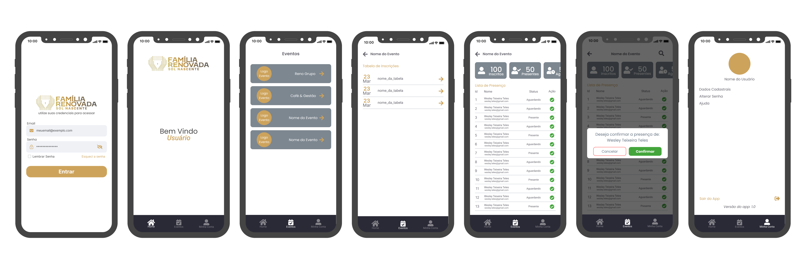

# Event Check App



Essa aplicação foi um desafio da matéria de desenvolvimento de aplicativo onde a nota final era criar um projeto que atendesse uma necessidade do mundo real, sendo assim, foi escolhido uma empresa que possui um site que alguns eventos que são realizados durante o ano porém sem muito controle na hora de contabilizar as pessoas e sem a possibilidade de check-in de cada um.

O Event Check App é uma aplicação que gerencia eventos e inscricoes de eventos realizados permitindo que o usuário possa acessar cada evento que está sendo criado no site dele e assim poder contabilizar quantas pessoas foram inscritas e permitindo tambem realizar um check-in de cada pessoa inscrita nos eventos.

Esta aplicação é construída com React Native e um mock (Banco de dados Fake) como banco, que é uma forma de visualizar os dados sem tem um banco de dados.

## Recursos

- Visualize todos os eventos cadastrados.
- Visualize todas as incricições dos eventos criados.
- Marque sua presença em eventos.
- Visualize eventos passados e futuros separadamente.

## Instalação

Você pode clonar este repositório e executar a aplicação localmente em sua máquina. Certifique-se de ter [requisitos do sistema] instalados.

```
git clone https://github.com/WesleyTTeles/event-check-app.git
```

```
cd event-check-app
```

# Uso

Após a instalação, você pode iniciar a aplicação com o seguinte comando:

```
npm start
```

## Contribuição

Contribuições são bem-vindas! Se você deseja contribuir para o desenvolvimento do Event Check App, siga estas etapas:

- Faça um fork do repositório
- Crie uma nova branch para sua contribuição: git checkout -b feature/sua-contribuicao
- Faça suas alterações e commit: git commit -m 'Adicione sua contribuição'
- Envie suas alterações para o seu fork: git push origin feature/sua-contribuicao
- Abra um pull request para o repositório principal
